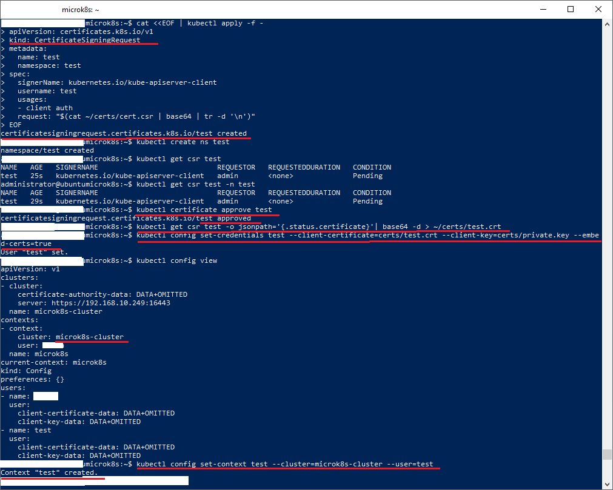
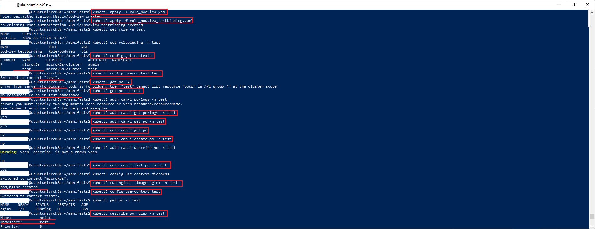

### Инструменты / дополнительные материалы, которые пригодятся для выполнения задания

1. [Описание](https://kubernetes.io/docs/reference/access-authn-authz/rbac/) RBAC.
2. [Пользователи и авторизация RBAC в Kubernetes](https://habr.com/ru/company/flant/blog/470503/).
3. [RBAC with Kubernetes in Minikube](https://medium.com/@HoussemDellai/rbac-with-kubernetes-in-minikube-4deed658ea7b).

------

### Задание 1. Создайте конфигурацию для подключения пользователя

1. Создайте и подпишите SSL-сертификат для подключения к кластеру.
2. Настройте конфигурационный файл kubectl для подключения.
3. Создайте роли и все необходимые настройки для пользователя.
4. Предусмотрите права пользователя. Пользователь может просматривать логи подов и их конфигурацию (`kubectl logs pod <pod_id>`, `kubectl describe pod <pod_id>`).
5. Предоставьте манифесты и скриншоты и/или вывод необходимых команд.

### Решение

1. В зависимости от кластера может потребоваться настройка режима авторизации
 - В *microk8s* по умолчанию авторизация осуществляется с ключом *authorization-mode=AlwaysAllow*, что предоставляет полные права любому пользователю. Для того чтобы
    ограничить права необходимо включить режим RBAC. Это делается командой:
     ```microk8s enable rbac```.
     После включния RBAC нужно перезапустить кластер командами ```microk8s stop``` и ```microk8s start``` 
 - В кластере *k8s* режимы указываются в файле */etc/kubernetes/manifests/kube-apiserver.yaml*. По умолчанию значения режимов: ```--authorization-mode=Node,RBAC```
    Включать RBAC дополнительно не нужно. Ниже привожу краткую таблицу режимов:

    | Имя режима        |            Описание                                          |
    |-------------------|--------------------------------------------------------------|
    | AlwaysAllow       | Полные права по умолчанию всем авторизованным пользователям  |
    | RBAC              | Права на основе Role и RoleBinding                           |
    | Node              | Права подам на основе того на каком узле они запущены.       |

2. Создаем самоподписанный сертификат:
  ```openssl req -nodes -newkey rsa:4096 -keyout private.key -out cert.csr -subj "/CN=test" ```
  Чтобы генерировать приватный ключ в открытом виде используем ключ *-nodes*. В этом случаем не нужно вводить *PEM pass phrase*
  Указываем имя пользователя в части *Common Name(CN)*, группу указываем в части *Organization(O)*.
  Возможно указание системных групп. Ниже представлена краткая таблица с наиболее часто используемыми группами: 

   | Имя группы    |       Описание                                                                                                       |
   |---------------|----------------------------------------------------------------------------------------------------------------------|
   | cluster-admin | Супер пользователь с полными правами администратора кластера                                                         |
   | admin         | Имеет права на чтение/запись, включая role и rolebinding. Не имеет права на определение квот ресурсов                |
   | edit          | Имеет права на чтение/запись, исключая role и rolebinding. Имеет права на чтение/запись к secret и serviceaccount    |
   | view          | Имеет права на чтение почти всех объектов за исключением role, rolebinding, а также secret и serviceaccount.         |

3. Создаем запрос на подписание сертификата:
``` 
cat <<EOF | kubectl apply -f -
apiVersion: certificates.k8s.io/v1
kind: CertificateSigningRequest
metadata:
  name: test
  namespace: test
spec:
  signerName: kubernetes.io/kube-apiserver-client
  username: test 
  usages:
  - client auth
  request: "$(cat ~/certs/cert.csr | base64 | tr -d '\n')"
EOF
``` 
Основной плюс такого подхода в том, что 
 - В кластере не создаются лишние объекты serviceaccount, secret. 
 - Не нужно копировать и вставлять токены.
 
4. Подтверждаем сгенерированный сертификат CA-сертификатом кластера:
  ```kubectl certificate approve test```
  В качестве имени подтверждаемого сертификата используется имя *CertificateSigningRequest* 

5. Экспортируем сертификат из блока *certificate*  манифеста подтвержденного запроса предварительно декодировав его из base64:
  ```kubectl get csr test -o jsonpath='{.status.certificate}'| base64 -d > ~/certs/test.crt```

6. Добавляем пользователя test с сертификатом, расположенным в файле test.crt:
  ```kubectl config set-credentials test --client-certificate=certs/test.crt --client-key=certs/private.key --embed-certs=true``` 
  Нельзя указать домашнюю директорию пользователя символом "~" несмотря на то, что в документации использован пример с "~". Можно указать либо полный путь, либо относительную папку.

  Чтобы удалить пользователЯ из .kube/config нужно выполнить команду:
  ```kubectl config delete-user test```

7. Создаем контекст в ~/.kube/config:
  ```kubectl config set-context test --cluster=microk8s-cluster --user=test```
    Имя кластера узнаем командой: ```kubectl config view```
  
    Вид окна создания контекста пользователя представлен на скриншоте:
    

8. Создаем роль *podview*. Можно использовать манифест, который приведен в [файле](manifests/role_podview.yaml), либо конманду:
```kubectl create role podview --verb=get,watch --resource=pods -n test```

9. Создаем привязку пользователя *test* к роли *podview*. Можно использовать манифеста, который расположен в [файле](manifests/role_podview_testbinding.yaml), либо используя команду:
  - Для пользователя test: ```kubectl create rolebinding podview_testbinding --role=podview --user=test -n test```
  - Для группы admins: ```kubectl create rolebinding podview_adminsbinding --role=podview --group=admins -n test```

10. Проверяем наличие и отсутсвие прав командами:
  ```kubectl auth can-i <verb> <object> -n <namespace>```
  